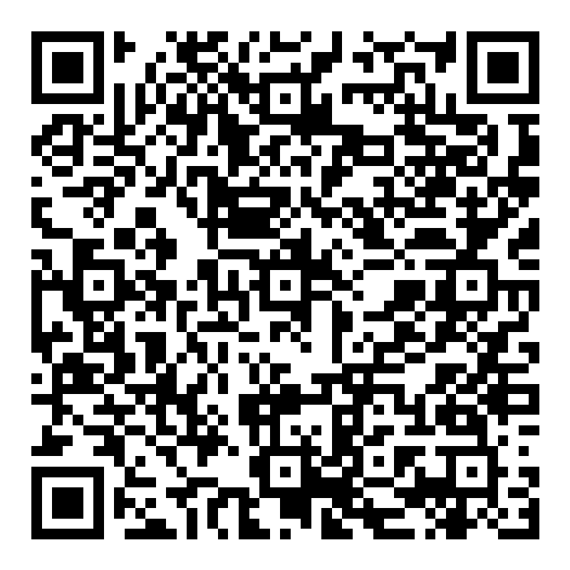

# Mobile DLC Labeler: User Manual

Last checked: September 25, 2026

This guide covers the independent, browser-based labeler for the `sp1DLC` project. It works across networks on a phone or computer. The active site is hosted on Cloudflare, not ChatGPT. The older ChatGPT-hosted copy is not the working site.

For whether the laptop must stay on, routine monitoring, Cloudflare limits, and outage steps, see [Keeping the Site Live](Site_Operations_Guide.md).

## Quick reference

| Item | Where |
| --- | --- |
| Live editor | https://mobile-dlc-labeler.mobile-dlc-independent-labeler.workers.dev/ |
| Shareable QR | [Share_Independent_Labeler_QR.png](Share_Independent_Labeler_QR.png), or **Share labeler** inside the editor |
| Access code | Ask the owner separately. It is **not** encoded in the QR or this manual. |
| Worklists | `sp1DLC`: 1,865 frames in 31 Test folders; `EPM`: 640 frames in 32 video folders |
| Body points | Nose, Left ear, Right ear, Mid spine, Left lateral, Right lateral, Tail base |
| Save | Automatic after each edit; wait for **Saved** before leaving the page |
| Backup | **Download label snapshot** saves a JSON file to your device |

**Fastest safe workflow:** Open the live link, enter the access code, choose the experiment and video folder/frame, select a body point, switch to **Place**, and tap the image. Continue through the point sequence. Use **Move** to inspect or pan without placing. Check **Saved** after edits and download a snapshot after a labeling session.



## Share and sign in

1. Send the live link or the QR image to a trusted collaborator. The QR is also available under **Share labeler** in the editor; **Copy link** copies the live URL.
2. Send the access code through a separate message or channel. Do not put it on a slide, in a public QR graphic, or in a shared copy of this manual.
3. The recipient opens the link and enters the code once on that device. No Cloudflare or ChatGPT account is needed. The signed-in session lasts up to 30 days; **Sign out** ends it on that device.

Everyone who has the link **and** access code has the same editing access. There are no separate viewer/editor roles or per-person accounts. Share only with people authorized to see the frame images and edit labels. A QR from `Start_Labeler.bat` is for the *local laptop server*, usually only reachable on the same network; use the Cloudflare QR above for cross-network sharing.

## Label a frame

1. Choose **Experiment** (`sp1DLC` or `Elevated plus maze`), then use **Video folder**, previous/next arrows, or the frame slider. The counter and **Next incomplete frame** stay within the selected experiment.
2. Check the worklist count (`0 / 7` through `7 / 7`) and body-point list. A check mark means that point has a marker on this frame. **Next missing point** selects an unlabeled point but does not enter Place mode.
3. Stay in **Move** while inspecting. Drag blank image space to pan; drag an existing marker to correct it. Tapping blank space in Move does not create a marker.
4. To add or replace a marker, select its body point, press **Place**, then tap the correct location on the image. Each successful tap advances to the next body point in this order: **Nose -> Left ear -> Right ear -> Mid spine -> Left lateral -> Right lateral -> Tail base**. It advances even if the next point already has a marker, so check the selected name before each tap. After Tail base, the editor returns to Move.
5. For corrections, select a point and place it again, or drag its existing marker in Move. Use **Undo** or **Redo** for recent edits on the current frame. To remove points, use **Multi-select**, tap the markers you want, then press **Delete**.
6. Wait for the top status to say **Saved**. Moving to another frame resets to Move and clears the current frame's Undo/Redo history.

In Place mode, a deliberate tap places a point; dragging the image pans instead. Two-finger pinch zooms. On desktop, the mouse wheel zooms. Use `+`, `-`, or **Fit** to adjust the view. **Marker display** changes size, shape, and color on this browser only; it does not change saved coordinates.

The editor uses the same seven body points in both experiments. In the original DLC project, **Mid spine** is `spine_mid`, **Left lateral** is `left_hip`, and **Right lateral** is `right_hip`. The other original DLC body parts are preserved during conversion back to that project.

## Back up and export

The live labels are stored in the site's Cloudflare D1 database, not in the browser or the laptop labeler's local state. An edit is not confirmed until the status says **Saved**. Other devices may need to reload the frame to see the latest edit.

At the end of each work session, and **before any site maintenance**, press **Download label snapshot**. Keep the downloaded `dlc-labels-YYYY-MM-DD.json` in a dated backup folder, with an additional copy outside this laptop if possible. If you download more than once on the same day, keep distinct copies rather than overwriting the previous one. A JSON snapshot includes all frames and current labels; it is a backup/interchange file, **not** a DLC H5 file. Do not edit it by hand.

To convert a downloaded snapshot to DLC H5 and CSV, open PowerShell in `C:\Users\kobeq\Documents\MobileDLC\independent_labeler` and run:

```powershell
& "C:\Users\kobeq\miniconda3\envs\dlc\python.exe" import_hosted.py "C:\path\to\dlc-labels-YYYY-MM-DD.json" "C:\Users\kobeq\Documents\checking protocol\sp1DLC"
```

The converter checks the project schema, scorer, frames, and points, then writes new files under `independent_labeler\imports\<timestamp>\export\labeled-data\`. It converts the original `sp1DLC` frames; EPM labels remain in the JSON snapshot until a matching DLC training project is prepared. It does **not** overwrite the original DLC project or the laptop labeler's journal. Review the output in DLC/napari before copying any H5/CSV files into the working project. Keep both the original JSON and converted output as backups.

For Google Colab retraining, use the [Colab training handoff](Colab_Training_Handoff.md). The converter is already implemented; repeat it only when you want newer website labels included in a new DLC training dataset.

## Present without changing data

**Before the presentation:** Check that the live link opens on your phone and presentation computer, that both are signed in, and that a recent label snapshot has been downloaded. Have the QR image and URL ready. Do not show the access code on screen. If others will scan during the presentation, give the code only to intended editors.

**A short demo:** Show the QR and open the editor. Point out the experiment and video-folder menus, frame counter, worklist, body-point sequence, and **Next incomplete frame**. Demonstrate zoom/pan in Move mode and the Share panel. Explain that Place is deliberate and each edit auto-saves. Only demonstrate actual placement if you intend that marker to become a real project annotation; there is no separate demo mode on the live site.

**Key explanation:** "This is our seven-point labeler for the original sp1DLC videos and elevated plus maze videos. The 2,505 frame images are available through a private-access Cloudflare site, and labels are saved centrally so trusted collaborators can work from different networks. We export a JSON backup; the original sp1DLC labels can be converted to DLC H5/CSV without altering the source project automatically."

## Troubleshooting

| Symptom | What to do |
| --- | --- |
| Link or QR goes to ChatGPT, an old site, or a local IP | Use the live Cloudflare URL above. The older site and `Start_Labeler.bat` QR are different destinations. |
| "That access code is not valid" | Get the current code from the owner. Spaces, hyphens, and letter case are ignored. Do not keep guessing. |
| "Too many attempts" | Stop and wait 15 minutes, then try the verified code. |
| Asked to sign in again | The session expired, was signed out, or was invalidated by an owner secret change. Enter the code again. |
| Blank/loading frame image | Check the internet connection, wait for loading, reload, and try another frame. If it persists on multiple devices, tell the owner which experiment, video folder, and frame failed. |
| Tap does not add a marker | Select a body point and press **Place**. Check the top badge for the active point. A drag pans; a completed tap inside the image places. Every frame change returns to Move. |
| Unexpected marker or moved point | Use **Undo** while still on that frame, then verify **Saved**. For an older mistake, select the point and correct it, or use Multi-select and Delete. |
| "Saving..." does not become "Saved" | Check connectivity and wait. Do not assume the edit reached the server. If **Save failed** appears, reload that frame and inspect its actual markers before trying again. |
| "This frame changed on another device" | Another editor saved first. The app reloads the latest frame and clears Undo/Redo. Review the markers before making a new edit. Coordinate with the other editor to avoid working on the same frame simultaneously. |
| Another device shows older labels | Wait for **Saved** on the editing device, then reload or revisit the frame on the second device. |
| Next missing point is disabled or Next incomplete finds nothing | The current frame already has all seven points, or all frames in the selected experiment are complete, respectively. |
| Download did not appear | Check the browser's Downloads list/permission, then retry after **Saved**. If export reports an error, keep the page open and contact the owner. |
| Laptop labeler shows different edits | The local labeler and Cloudflare site have separate stores. A cloud JSON snapshot must be converted and reviewed before it becomes DLC H5/CSV; there is no automatic two-way sync. |
| Site unavailable for everyone | Owner: check Cloudflare service status and the `mobile-dlc-labeler` Worker / `mobile-dlc-labeler-db` D1 database. Do not rerun the one-time migration or replace the database as a quick fix. |

When reporting a problem, include the live URL, experiment, video folder, frame name or counter number, device/browser, exact on-screen error, and whether the top status reached **Saved**. Do **not** send the access code or private frame images in a public issue or screenshot.

## Owner maintenance

The source app is in `C:\Users\kobeq\Documents\MobileDLC\independent_labeler`. The original DLC project is in `C:\Users\kobeq\Documents\checking protocol\sp1DLC`. The current access code is stored in the local ignored file `independent_labeler\imports\access-code.txt`; treat it as a secret and do not share that file. Project images and historical imports are also local source/backup material, not files to delete casually.

Before changing the site, download and retain a fresh label snapshot. From the `independent_labeler` directory, run `npm test` to check the build and unit tests. After reviewing the change, `npm run deploy` publishes a new Worker version to the existing D1 database specified in `wrangler.jsonc`. Check the live login, a few frames, a saved edit, and a new export afterward. The deployment does **not** need the one-time `imports/migration.sql`; never rerun that SQL against the live database.

If the access code is exposed, rotate the Cloudflare `ACCESS_CODE` secret. Changing the code alone does not end existing signed-in sessions; rotate `SESSION_SECRET` too when access must be revoked. This signs everyone out. Secret changes and deployment require access to the owning Cloudflare account; keep that account protected. For live Worker errors, use the Cloudflare dashboard or `npx wrangler tail mobile-dlc-labeler` from the app directory ([Cloudflare Wrangler logs](https://developers.cloudflare.com/workers/wrangler/commands/workers/)). For serious database recovery, download/retain the latest JSON first and consult [Cloudflare D1 Time Travel](https://developers.cloudflare.com/d1/reference/time-travel/); a restore overwrites the current database and should never be a first troubleshooting step.

The Windows `mobile_dlc_labeler\Start_Labeler.bat` is an **offline/local alternative**, not a way to administer the cloud site. It reads the original DLC project, writes its own `full_project_state`, and needs the laptop server running. See [its README](mobile_dlc_labeler/README.md) for local installation. The old 40-frame pilot or a tab on port 8765 is not the full cloud project.
